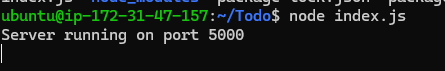
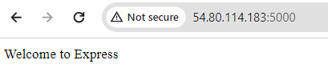
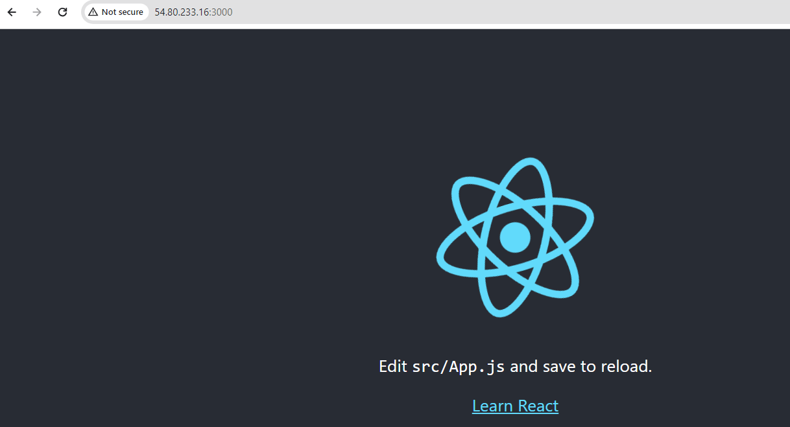
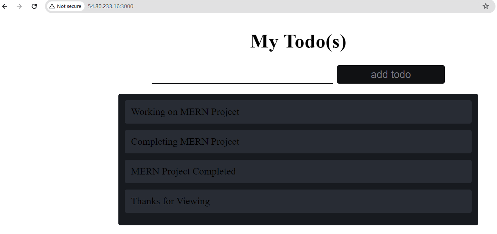

## Awesome Documentation of mern-project

`sudo apt update`

`sudo apt upgrade`

`curl -fsSL https://deb.nodesource.com/setup_18.x | sudo -E bash -`

`sudo apt-get install -y nodejs`

`node -v`

`npm -v`

`npm install -g npm@10.2.5`

`npm -v`

`mkdir Todo`

`ls`

`cd Todo`

`npm init`

`npm install express`

`touch index.js`

`npm install dotenv`

`vi index.js`

`mkdir routes && cd routes`

`touch api.js`

`vi api.js`

`npm install mongoose`

`mkdir models && cd models && touch todo.js`

`vi todo.js`

`cd routes`

`vi api.js & :%d` # to delete the content inside the file and replace with new code

`vi .env`

`vi index.js & :%d` # to delete the content and replace with new code

`node index.js`

-[install postman](https://www.postman.com/downloads/)

`npx create-react-app client`

`npm install concurrently --save-dev`

`npm install nodemon --save-dev`

`vi package.json` # to edit content  and replace the script side

`cd client`

`vi package.json` # to edit content by adding "proxy": "http://localhost:5000",

`npm run dev`(./port-3000.PNG)

`cd Todo && cd client && cd src`

`mkdir components`

`cd components`

`touch Input.js ListTodo.js Todo.js`

`vi Input.js`

`cd client`

`npm install axios`

`cd src/components`

`vi ListTodo.js`

`vi Todo.js`

`cd src`

`vi App.js & :%d` # to edit content

`vi App.css & :%d` # to edit content

`vi index.css & :%d` # to edit content

`npm run dev`

